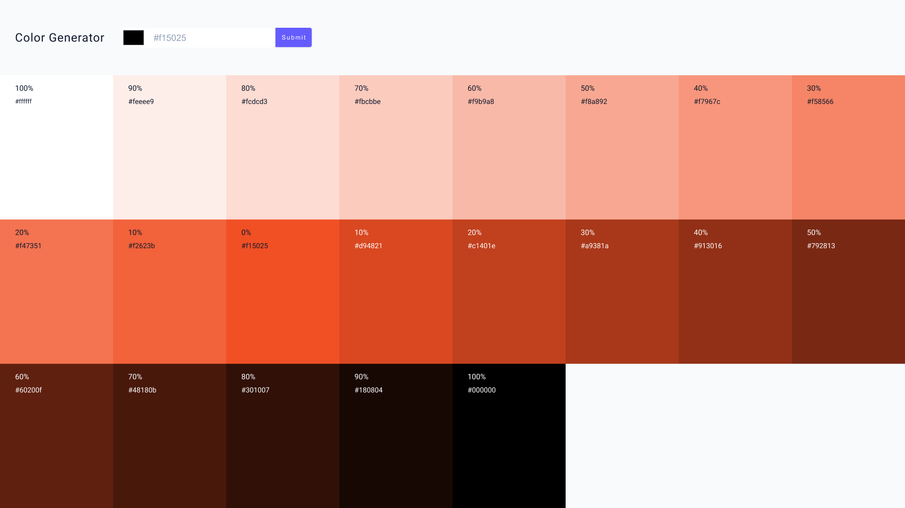

## Figma URL

[Color generator](https://www.figma.com/file/P2SJ5QGOZvi49EOpoVTvsT/Color-generator?node-id=0%3A1&t=ZY2gnIJ9zGTSXPW8-1)

## Usage

```sh
npm install
npm run dev
```

[HTML Color Input](https://developer.mozilla.org/en-US/docs/Web/HTML/Element/input/color)

#### Values.js

Install the values.js library and use it to generate a list of colors in the App component.

[Values.js Library](https://github.com/noeldelgado/values.js/blob/master/README.md)

```sh
npm i values.js

```

```js
import Values from 'values.js'
new Values('#f15025').all(10)
```

#### React-Toastify

Import and set up the react-toastify library.

[React Toastify](https://fkhadra.github.io/react-toastify/introduction)

```sh
npm i react-toastify
```

main.jsx

```js
import 'react-toastify/dist/ReactToastify.css'
```

App.jsx

```js
import { ToastContainer, toast } from 'react-toastify'

toast.success('awesome')
toast.error('error message')

return (
  <main>
    ...............
    <ToastContainer position="top-center" />
  </main>
)
```

#### Clipboard

```js
async function copyToClipboard(text) {
  try {
    await navigator.clipboard.writeText(text)
    console.log('Text copied to clipboard')
  } catch (error) {
    console.error('Failed to copy text: ', error)
  }
}

const textToCopy = 'Hello, world!'
copyToClipboard(textToCopy)
```
