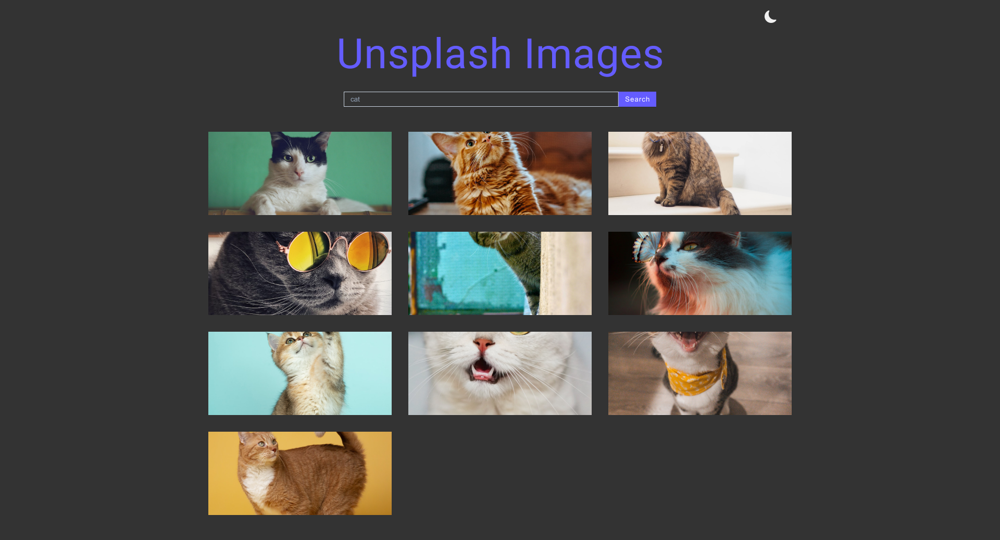

[Unsplash API](https://unsplash.com/developers)

## Usage

```sh
npm install
npm run dev
```

#### User Prefers Dark Mode

```css
@media (prefers-color-scheme: dark) {
  :root {
    --textColor: var(--dark-mode-text-color);
    --backgroundColor: var(--dark-mode-bg-color);
  }
}
```
