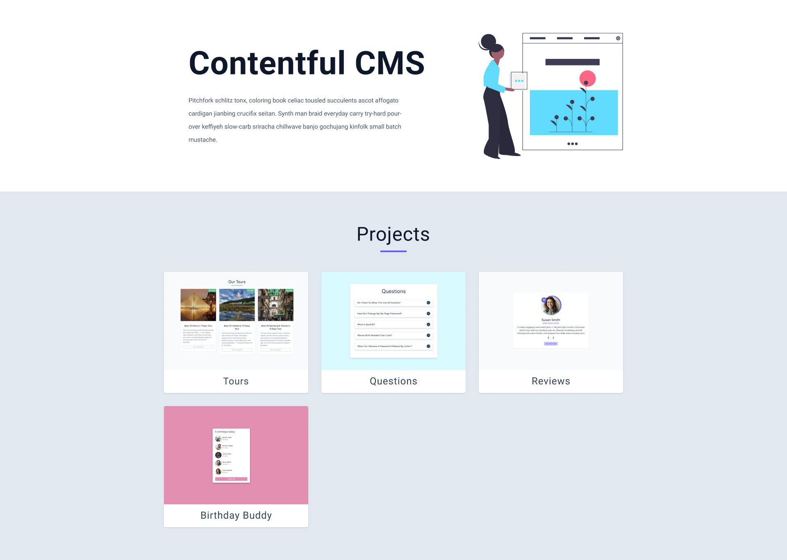

## Usage

```sh
npm install
npm run dev
```

#### Images

[Undraw](https://undraw.co/)

#### Contentful

[Contentful ](https://www.contentful.com/)

#### Install SDK

- npm install contentful

#### Get Entries

```js
import { createClient } from 'contentful'

const client = createClient({
  space: 'qz00uzgg3le7',
  environment: 'master', // defaults to 'master' if not set
  accessToken: import.meta.env.VITE_API_KEY,
})

client
  .getEntries({ content_type: 'projects' })
  .then((response) => console.log(response.items))
  .catch(console.error)
```
